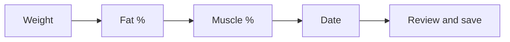

# Body History

Private Django app for long-term weight and body-composition history.

Replaces a spreadsheet workbook as the source of truth while keeping the
original file as immutable import evidence **outside git**.

## Quick start

```sh
cd /srv/satellite/apps/body-history
docker compose up -d --build
```

| Surface | URL |
|---------|-----|
| Public UI | your Cloudflare hostname (see host secrets) |
| Phone quick-add (homescreen) | `https://<your-host>/manual_import/` |
| LAN | `http://<lan-host>:3060/` |

## What not to commit

Never commit:

- `/srv/satellite/secrets/body-history.env`
- workbooks (`.xlsx`)
- exports/CSV dumps of measurements
- anything under `imports/` or `/srv/satellite/data/body-history/`

Only `.env.example` belongs in git for environment documentation.

## Locations

| Path | Role |
|------|------|
| `/srv/satellite/apps/body-history` | Application code (this repo) |
| `/srv/satellite/data/body-history/imports` | Source workbook and text imports |
| `/srv/satellite/data/body-history/exports` | Generated exports |
| `/srv/satellite/secrets/body-history.env` | Secrets and DB credentials |

## Stack

- Django + server-rendered templates
- PostgreSQL database `body_history`, schema `body`
- ECharts for the primary trend chart
- Docker Compose on host port `3060`
- Trusted-device login (hashed token cookie, 180 days)

## Main features

- Dashboard with latest values and period deltas (kg / percentage points)
- History table, CSV export, trend chart
- Excel dry-run + audited import
- `/manual_import/` phone-friendly step flow:



## Operations

See [docs/README.md](docs/README.md) for the doc index, including:

- [docs/operations.md](docs/operations.md) — deploy, bootstrap user, import, tests
- [docs/privacy.md](docs/privacy.md) — auth, exposure, data handling
- [docs/architecture.md](docs/architecture.md) — components and data model sketch

Decision and product specs (also in-repo):

- `PROJECT_DECISION.md` — naming, ports, database choice
- `SPEC.md` — implementation specification

## Tests

```sh
docker compose run --rm --entrypoint "" -e BODY_HISTORY_USE_SQLITE=1 body-history pytest
```
