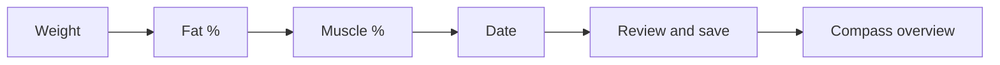

# Body History

Private Django app for long-term weight and body-composition history.

Replaces a spreadsheet workbook as the source of truth while keeping the
original file as immutable import evidence **outside git**.

## Quick start

```sh
cd /srv/satellite/apps/body-history
docker compose up -d --build
```

| Surface | URL |
|---------|-----|
| Public UI | your Cloudflare hostname (see host secrets) |
| Phone quick-add (homescreen) | `https://<your-host>/manual_import/` |
| Compass | `https://<your-host>/compass/` |
| LAN | `http://<lan-host>:3060/` |

## What not to commit

Never commit:

- `/srv/satellite/secrets/body-history.env`
- workbooks (`.xlsx`)
- exports/CSV dumps of measurements
- personal target numbers as code constants or fixtures
- anything under `imports/` or `/srv/satellite/data/body-history/`

Only `.env.example` belongs in git for environment documentation.

## Locations

| Path | Role |
|------|------|
| `/srv/satellite/apps/body-history` | Application code (this repo) |
| `/srv/satellite/data/body-history/imports` | Source workbook and text imports |
| `/srv/satellite/data/body-history/exports` | Generated exports |
| `/srv/satellite/secrets/body-history.env` | Secrets and DB credentials |

## Stack

- Django + server-rendered templates
- PostgreSQL database `body_history`, schema `body`
- ECharts for trend chart and Compass history
- Docker Compose on host port `3060`
- Trusted-device login (hashed token cookie, 180 days)

## Main features

- Dashboard with latest values, period deltas, Target Alignment (sparkline + component mini-bars), and guidance
- **Body Compass** (`/compass/`):
  - Alignment History (overall + components)
  - Position vs Target range bars
  - Opportunity Impact ranked bars
  - interactive simulator, milestones, fitness signals
- One body profile per UI user
- History table, CSV export, metric trend chart
- Excel dry-run + audited import (scoped to that profile)
- Versioned target **ranges** + algorithm prefs in Settings (DB-only personal data)
- `/manual_import/` phone-friendly step flow with **Close** to dashboard, post-save Compass + alignment delta + mini-charts:



## Operations

See [docs/README.md](docs/README.md) for the doc index, including:

- [docs/evolutions.md](docs/evolutions.md) — later product/platform decisions
- [docs/operations.md](docs/operations.md) — deploy, UI-user CLI, import, Compass
- [docs/privacy.md](docs/privacy.md) — auth, exposure, data handling
- [docs/architecture.md](docs/architecture.md) — components and data model
- [docs/features/body-compass-as-built.md](docs/features/body-compass-as-built.md) — Compass status (done checklist)
- [docs/features/body-compass-spec.md](docs/features/body-compass-spec.md) — original product/feature specification

Decision and product specs (also in-repo):

- `PROJECT_DECISION.md` — naming, ports, database choice
- `SPEC.md` — original MVP implementation specification

## Tests

Use **pytest** only (this is the project test runner). Do not use
`python manage.py test` — Django’s discovery finds zero tests here because the
suite is pytest-style under `records/tests/`.

```sh
docker compose run --rm --entrypoint "" -e BODY_HISTORY_USE_SQLITE=1 body-history pytest
```
