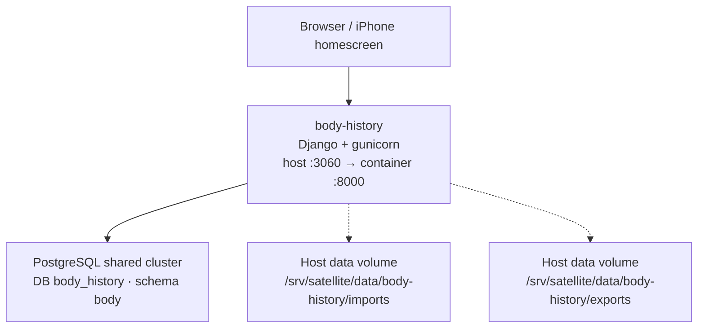
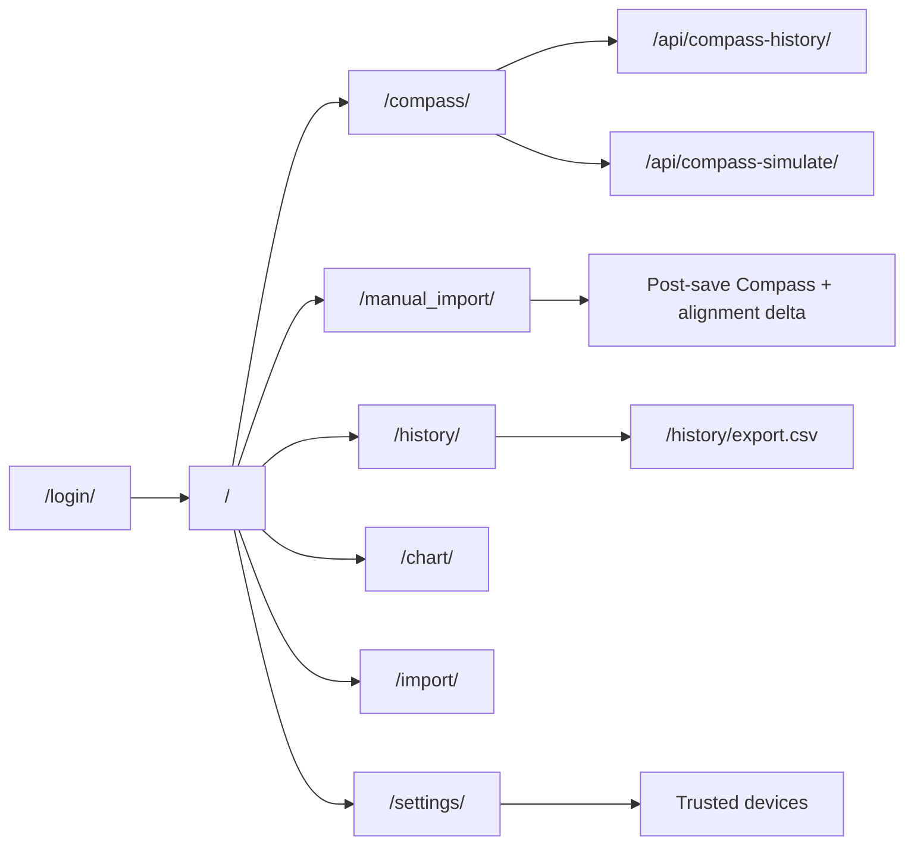
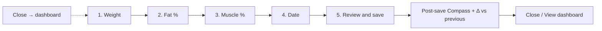
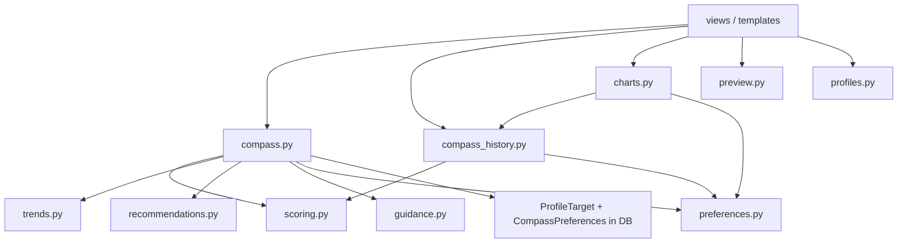
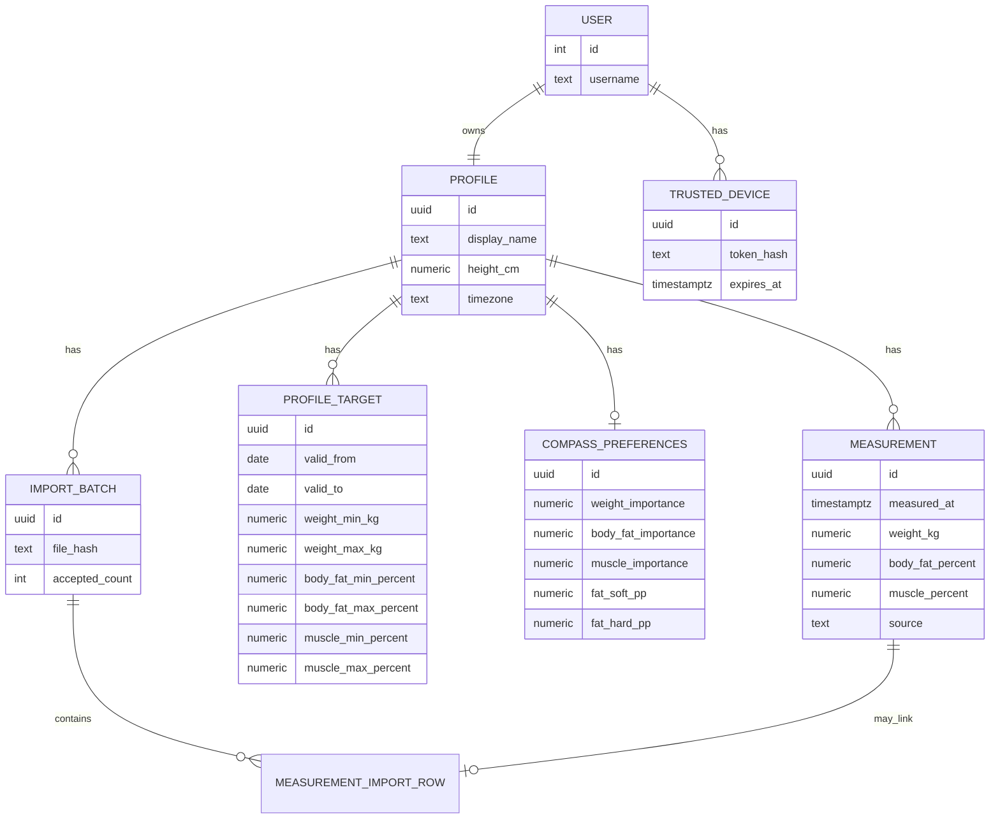

# Architecture

## Components

## Request surfaces

## Important routes

| Path | Purpose |
|------|---------|
| `/` | Dashboard (latest metrics + Target Alignment + guidance) |
| `/compass/` | Body Compass detail (scores, history, position bars, impact, simulator) |
| `/api/compass-history/` | Alignment / component score series JSON |
| `/api/compass-simulate/` | Counterfactual score JSON |
| `/manual_import/` | Phone step-by-step entry + Close to dashboard + post-save Compass |
| `/history/` | Table + filters |
| `/history/export.csv` | CSV export with derived BMI / fat mass |
| `/chart/` | Metric trend chart (raw + smooth) |
| `/import/` | Excel dry-run / import UI |
| `/settings/` | Profile, targets, algorithm prefs, devices |
| `/login/` | Sign-in |

## Profile

Each authenticated Django user has exactly one `Profile` (`OneToOneField`).
All measurement / Compass / settings writes apply to that profile. Users cannot
see another user’s data.

## Manual import flow

## Body Compass modules

Personal **target destinations** live only in `ProfileTarget` rows.  
Algorithm defaults live in `scoring.AlgorithmConfig`; optional overrides in `CompassPreferences`.

### Decision charts (shipped)

| Chart | Implementation |
|-------|----------------|
| Alignment History | ECharts time series via `/api/compass-history/` + `static/js/compass.js` |
| Position vs Target | HTML/CSS range bars from `records/charts.position_vs_target` |
| Opportunity Impact | Absolute 0–100 track; segment from current → simulated alignment (`records/charts.opportunity_impact`) |
| Dashboard / mobile mini | SVG sparkline + compact score bars (`alignment_sparkline`, `component_mini_bars`) |

Radar/spider charts are intentionally not used.

## Domain model (summary)

Derived metrics (BMI, fat mass kg, deltas, Target Alignment) are computed in code, not stored as facts on each measurement row.

## Excel mapping

Source sheet: `General`

| Workbook | App field |
|----------|-----------|
| Data | `measured_at` |
| Pes | `weight_kg` |
| % Grassa | `body_fat_percent` (fraction → percent) |
| % Muscul | `muscle_percent` (fraction → percent) |
| Alçada | profile `height_cm` (metres → cm) |
| IMC / Grassa / scores | ignored formulas; recalculate or drop |

## Local development notes

Production runs entirely in Docker.  
Optional SQLite for tests via `BODY_HISTORY_USE_SQLITE=1`.
