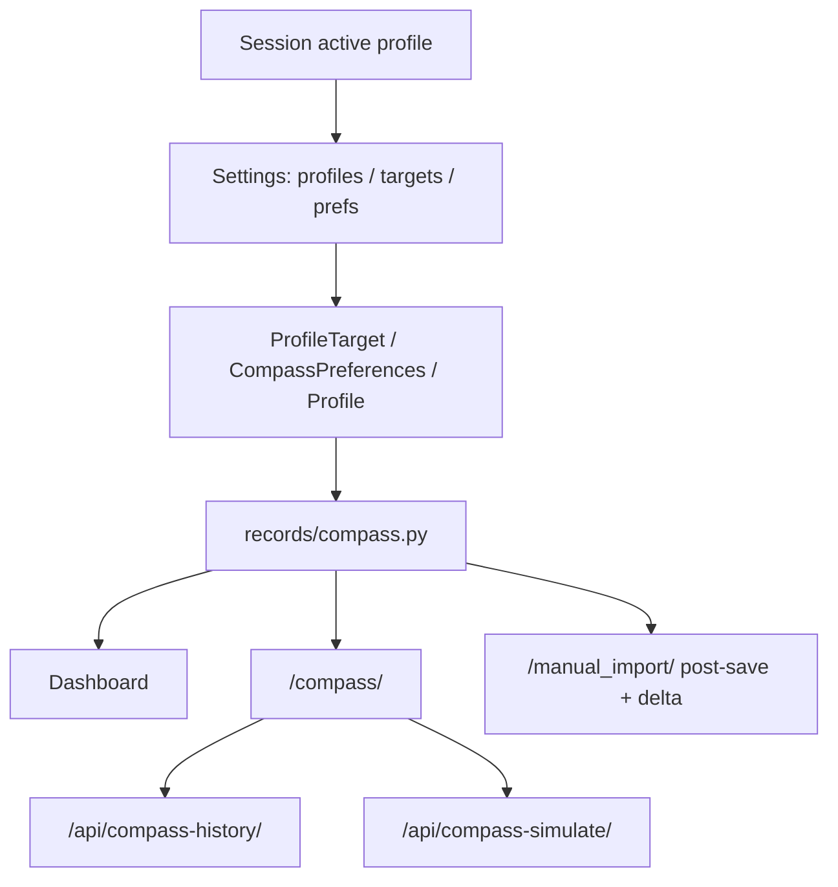

# Body Compass — As Built

Status of the shipped Body Compass feature versus
[body-compass-spec.md](body-compass-spec.md).

**Status: complete for phases 1–6 and the spec acceptance criteria.**  
Optional later ideas are listed at the bottom; they are not blockers.

Personal target values live in the `body_history` database only. They are not
committed as code constants, migrations with fixed personal numbers, or fixtures.

## Shipped now

| Area | Status |
|------|--------|
| Target ranges on `ProfileTarget` | Done |
| Multi-profile create + session switcher | Done |
| Active-profile scoping for all views | Done |
| Component scores 0–100 + overall Target Alignment | Done |
| Confidence + freshness | Done |
| Direction vs prior comparable period | Done |
| What-changed attribution on `/compass/` | Done |
| Alignment history chart + component toggles | Done |
| Overall score line emphasised on chart | Done |
| Default chart mode: today’s target | Done |
| Primary / secondary opportunity ranking | Done |
| Interactive opportunity simulator | Done |
| Milestone suggestions | Done |
| Action guidance copy | Done |
| Fitness signals (BMI / fat mass / target bands) | Done |
| Settings active-target preview + soft/hard bands | Done |
| Post-save alignment delta vs previous reading | Done |
| `CompassPreferences` + Settings UI | Done |
| Dashboard / Compass / mobile post-save | Done |
| `seed_compass_targets` CLI (args only) | Done |

## Spec acceptance criteria

All items from the spec are met:

1. Versioned target ranges in DB  
2. Initial weight center via DB data (not code)  
3. Fat/muscle targets from sustained historical bests via DB data  
4. Overall Target Alignment 0–100  
5. Decomposable component scores  
6. Improving / stable / drifting direction  
7. What-changed attribution  
8. Primary + optional secondary opportunity  
9. Explanation of why  
10. Weight / fat / muscle simulation  
11. Maintain when near target  
12. Mobile post-save Compass overview  
13. Composition preferred over blind weight loss  

## Delivery phases covered

1. Alignment foundation  
2. Direction + history chart  
3. Mobile post-save compass (+ delta)  
4. Recommendations + simulator  
5. Guidance + fitness signals + algorithm prefs  
6. Multi-profile household switching + target preview  

## Optional later (not required)

- Richer wearable / extra fitness signal inputs beyond derived BMI/fat mass  
- Auth-linked profile ownership (today: shared login, session-selected profile)  

## Runtime boundary reminder

| May live in code | Must live in DB / host data only |
|------------------|-----------------------------------|
| Default scoring weights / soft-hard bands | Weight / fat / muscle target ranges |
| Default trend windows | Active and historical `ProfileTarget` rows |
| | Optional per-profile `CompassPreferences` overrides |

## Key modules

| Module | Role |
|--------|------|
| `records/profiles.py` | Active profile session selection |
| `records/scoring.py` | Range scoring + `AlgorithmConfig` defaults |
| `records/preferences.py` | Resolve profile algorithm overrides |
| `records/guidance.py` | Action guidance + fitness signals |
| `records/preview.py` | Settings target/trend preview |
| `records/compass.py` | Structured snapshot for UI |
| `records/compass_history.py` | Alignment history series + simulator payload |
| `static/js/compass.js` | History chart + simulator client |

## Operator notes

See [../operations.md](../operations.md#body-compass) for targets, prefs, profiles, and APIs.
