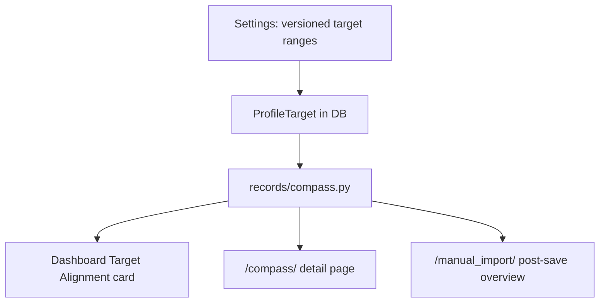

# Body Compass — As Built

Status of the shipped Body Compass feature versus
[body-compass-spec.md](body-compass-spec.md).

Personal target values live in the `body_history` database only. They are not
committed as code constants, migrations with fixed personal numbers, or fixtures.

## Shipped now

| Area | Status |
|------|--------|
| Target ranges on `ProfileTarget` | Done |
| Legacy single-value fields kept for migration fallback | Done |
| Component scores 0–100 + overall Target Alignment | Done |
| Confidence + freshness | Done |
| Direction vs prior comparable period | Done |
| Primary / secondary opportunity ranking | Done (basic counterfactuals) |
| Dashboard alignment card | Done |
| `/compass/` page | Done |
| Mobile post-save Compass overview | Done |
| Settings form for ranges | Done |
| `seed_compass_targets` CLI (args only) | Done |
| Unit tests for scoring / recommendations / post-save | Done |

## Not shipped yet (later phases)

- Alignment history chart / component history toggles
- Interactive opportunity simulator UI
- Richer milestone generation and guidance copy
- Optional `CompassPreferences` model (algorithm prefs still code defaults)
- Explicit “recalculate all history using today’s target” mode

## Runtime boundary reminder

| May live in code | Must live in DB / host data only |
|------------------|-----------------------------------|
| Scoring weights (e.g. 25/45/30) | Weight / fat / muscle target ranges |
| Soft/hard tolerances | Active and historical `ProfileTarget` rows |
| Trend / comparison windows | Workbook and derived personal proposals under data imports |

## Key modules

| Module | Role |
|--------|------|
| `records/scoring.py` | Range scoring + algorithm defaults |
| `records/trends.py` | Window averages / variability |
| `records/recommendations.py` | Counterfactual ranking |
| `records/compass.py` | Structured snapshot for UI |
| `records/management/commands/seed_compass_targets.py` | One-off DB seed via CLI args |

## Operator notes

See [../operations.md](../operations.md#body-compass-targets) for seeding ranges without putting personal numbers in git.
