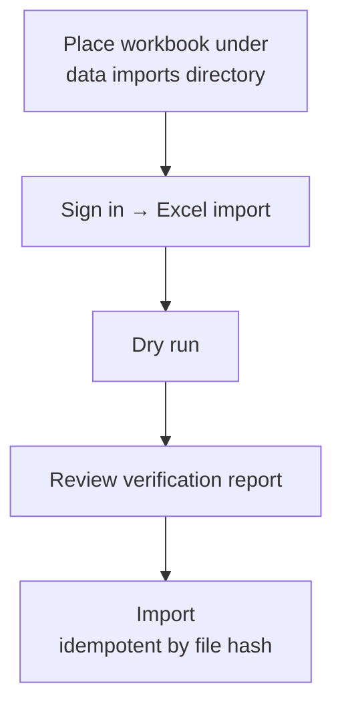

# Operations

## Deploy / restart

```sh
cd /srv/satellite/apps/body-history
docker compose up -d --build
```

Service name / container: `body-history`  
Host port mapping: `3060:8000`

Logs:

```sh
docker compose logs -f --tail 100
```

## Secrets

Copy `.env.example` to the host secrets file (never commit the real file):

```text
/srv/satellite/secrets/body-history.env
```

Required keys (names only):

```text
DJANGO_SECRET_KEY
DJANGO_ALLOWED_HOSTS
DJANGO_CSRF_TRUSTED_ORIGINS
POSTGRES_HOST
POSTGRES_PORT
POSTGRES_DB
POSTGRES_USER
POSTGRES_PASSWORD
```

Database identity for this app:

```text
POSTGRES_DB=body_history
POSTGRES_USER=body_history_app
```

Do not reuse a personal UI username as `POSTGRES_USER`.

After editing secrets:

```sh
docker compose up -d --force-recreate
```

## Bootstrap first UI user

Optional one-shot env vars in the secrets file:

```text
DJANGO_BOOTSTRAP_ADMIN_USER=yourname
DJANGO_BOOTSTRAP_ADMIN_PASSWORD=replace-me
DJANGO_BOOTSTRAP_ADMIN_EMAIL=optional@example.com
```

The entrypoint creates that user only when the auth user table is empty.  
After first login works, remove `DJANGO_BOOTSTRAP_ADMIN_PASSWORD` from the secrets file and recreate the container.

Manual alternative:

```sh
docker compose exec body-history python manage.py createsuperuser
```

## Import Excel workbook



1. Place the workbook at `/srv/satellite/data/body-history/imports/Pes.xlsx` (outside git).
2. Sign in → **Excel import** (runs against the **active profile**).
3. **Dry run** first; confirm unique dates / ranges.
4. **Import** (idempotent by file hash for the same profile).

Additional dated text blocks (if used) also belong under the data `imports/` directory, not in the git tree.

## Phone quick entry

URL path: `/manual_import/`


Intended for “Add to Home Screen”. No links to other app features during entry.  
After save, shows Target Alignment (including **Δ vs previous reading**), primary opportunity, and latest-vs-trend.  
Still requires Django login; trusted-device cookie avoids repeated passwords on known phones.  
Shows the active profile name in the header.

## Tests

```sh
docker compose run --rm --entrypoint "" -e BODY_HISTORY_USE_SQLITE=1 body-history pytest
```

## Profiles

Create and switch people under **Settings → Profiles**, or use the nav profile dropdown when more than one exists.

- Active profile is session-scoped.
- Measurements, target versions, and algorithm prefs are per profile.
- Excel import and Compass APIs use the active profile.

## Body Compass

### Targets

Personal target ranges live in the database only.

Create/update via **Settings → Body Compass targets**, or one-off:

```sh
docker compose exec body-history python manage.py seed_compass_targets \
  --valid-from YYYY-MM-DD \
  --weight-min ... --weight-max ... \
  --fat-min ... --fat-max ... \
  --muscle-min ... --muscle-max ... \
  --close-previous
```

Pass the numeric ranges as arguments. Do not commit personal target numbers into source.

Settings also shows an **active target preview** (trend vs ideal / soft / hard bands).

### Algorithm preferences

Under **Settings → Compass algorithm**:

- component importance weights
- soft/hard outer bands
- trend / comparison windows

These are not personal destinations. Defaults live in code; saving prefs writes `CompassPreferences` for the active profile.

### Charts and simulator

On `/compass/`:

- Alignment history chart (default mode: **today’s target**; optional historical targets)
- Component score toggles; overall line emphasised
- Opportunity simulator + milestones + guidance

JSON APIs:

- `/api/compass-history/?range=1y&mode=today|historical`
- `/api/compass-simulate/?weight_kg=...&body_fat_percent=...&muscle_percent=...`

Default soft/hard bands (unless prefs override): weight 1/3 kg; fat 2/6 pp; muscle 1.5/4 pp.  
Default importances: weight 25% / fat 45% / muscle 30%.
