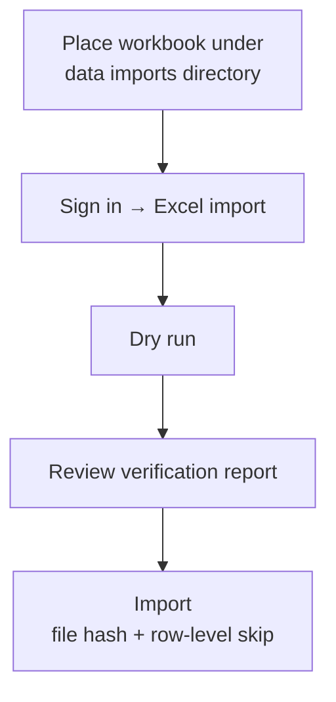

# Operations

## Deploy / restart

```sh
cd /srv/satellite/apps/body-history
docker compose up -d --build
```

Service name / container: `body-history`  
Host port mapping: `3060:8000`

Logs:

```sh
docker compose logs -f --tail 100
```

## Secrets

Copy `.env.example` to the host secrets file (never commit the real file):

```text
/srv/satellite/secrets/body-history.env
```

Required keys (names only):

```text
DJANGO_SECRET_KEY
DJANGO_ALLOWED_HOSTS
DJANGO_CSRF_TRUSTED_ORIGINS
DJANGO_SECURE_COOKIES
DJANGO_BEHIND_PROXY
POSTGRES_HOST
POSTGRES_PORT
POSTGRES_DB
POSTGRES_USER
POSTGRES_PASSWORD
```

Database identity for this app:

```text
POSTGRES_DB=body_history
POSTGRES_USER=body_history_app
```

Do not reuse a personal UI username as `POSTGRES_USER`.

After editing secrets:

```sh
docker compose up -d --force-recreate
```

## Bootstrap / manage UI users

UI logins are Django users (hashed passwords in the app DB). They are **not**
the same as `POSTGRES_USER` / `POSTGRES_PASSWORD` in the secrets file.

Preferred way to create or maintain UI users:

```sh
docker compose exec body-history python manage.py manage_body_user add --superuser
docker compose exec body-history python manage.py manage_body_user reset-password --username didac
docker compose exec body-history python manage.py manage_body_user deactivate --username olduser
docker compose exec body-history python manage.py manage_body_user activate --username olduser
docker compose exec body-history python manage.py manage_body_user list
```

`add` is interactive by default (username, email, password via getpass, optional
superuser + create profile for that user). Prefer the first account as
`--superuser`; later accounts are usually normal users.

For automation:

```sh
docker compose exec -e BH_TMP_PW='…' body-history \
  python manage.py manage_body_user add \
  --non-interactive --username newuser --password-env BH_TMP_PW
```

Never pass a plaintext password as a CLI positional argument. This command does
not alter `POSTGRES_*` or the secrets file.

Optional one-shot bootstrap env vars (only when the auth user table is empty):

```text
DJANGO_BOOTSTRAP_ADMIN_USER=yourname
DJANGO_BOOTSTRAP_ADMIN_PASSWORD=replace-me
DJANGO_BOOTSTRAP_ADMIN_EMAIL=optional@example.com
```

After first login works, remove `DJANGO_BOOTSTRAP_ADMIN_PASSWORD` from the secrets file and recreate the container.
Prefer `manage_body_user` for all later user management.

## Import Excel workbook



1. Place the workbook at `/srv/satellite/data/body-history/imports/Pes.xlsx` (outside git).
2. Sign in → **Excel import** (runs against your profile).
3. **Dry run** first; confirm unique dates / ranges.
4. **Import** (idempotent by file hash for the same profile).

Additional dated text blocks (if used) also belong under the data `imports/` directory, not in the git tree.

## Phone quick entry

URL path: `/manual_import/`


Intended for “Add to Home Screen”. Focused entry UI with a **Close** control
back to the dashboard.  
After save, shows Target Alignment (including **Δ vs previous reading**),
alignment sparkline, compact component bars, primary opportunity, and
latest-vs-trend.  
Still requires Django login; trusted-device cookie avoids repeated passwords on
known phones. Shows the profile display name in the header.

## Tests

Use **pytest** only. `python manage.py test` reports zero tests — the suite is
pytest-based under `records/tests/`, not Django’s `TestCase` discovery.

```sh
docker compose run --rm --entrypoint "" -e BODY_HISTORY_USE_SQLITE=1 body-history pytest
```

## Profile

Each UI user has one body profile (height, display name, prefs). Edit it under
**Settings → Profile**. Measurements, target versions, and algorithm prefs belong
to that profile. Excel import and Compass use it automatically.

## Body Compass

### Targets

Personal target ranges live in the database only.

Create/update via **Settings → Body Compass targets**, or one-off:

```sh
docker compose exec body-history python manage.py seed_compass_targets \
  --valid-from YYYY-MM-DD \
  --weight-min ... --weight-max ... \
  --fat-min ... --fat-max ... \
  --muscle-min ... --muscle-max ... \
  --close-previous
```

Pass the numeric ranges as arguments. Do not commit personal target numbers into source.

Settings also shows an **active target preview** (trend vs ideal / soft / hard bands).

### Algorithm preferences

Under **Settings → Compass algorithm**:

- component importance weights
- soft/hard outer bands
- trend / comparison windows

These are not personal destinations. Defaults live in code; saving prefs writes `CompassPreferences` for your profile.

### Charts and simulator

Decision charts (no radar/spider):

| Chart | Where | What it shows |
|-------|--------|----------------|
| **Alignment History** | `/compass/` | Overall + weight/fat/muscle scores over time (overall line emphasised) |
| **Position vs Target** | `/compass/` | Horizontal range bars: trend value vs ideal (+ soft band), gap in kg/pp |
| **Opportunity Impact** | `/compass/` | Absolute 0–100 track; green segment is today → simulated; `+gain` is points |
| **Mini sparkline + component bars** | Dashboard + `/manual_import/` post-save | Compact only — Close returns to dashboard |

Opportunity impact gain is a counterfactual delta (e.g. after −0.5 pp fat), not a forecast.

Alignment history controls:

- Ranges: 30d / 90d / 1y / 5y / all
- Target mode default: **today’s target** (optional: historical targets per date)

Also on `/compass/`: interactive opportunity simulator, milestones, guidance, fitness signals.

JSON APIs:

- `/api/compass-history/?range=1y&mode=today|historical`
- `/api/compass-simulate/?weight_kg=...&body_fat_percent=...&muscle_percent=...`

Chart payloads are built in `records/charts.py`.

Default soft/hard bands (unless prefs override): weight 1/3 kg; fat 2/6 pp; muscle 1.5/4 pp.  
Default importances: weight 25% / fat 45% / muscle 30%.
