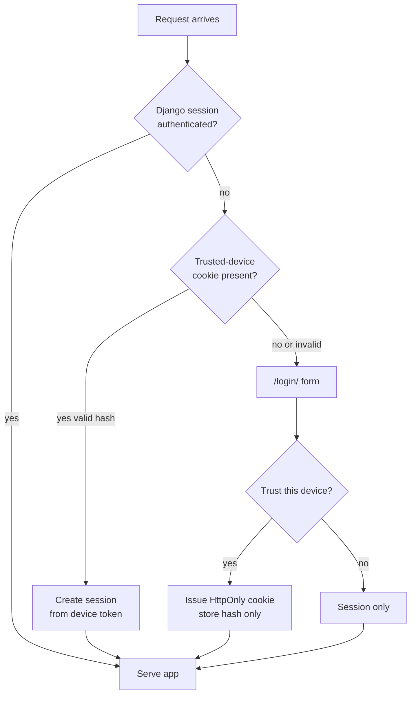

# Privacy and exposure

This app stores personal health data.

## Rules

- Require application authentication even behind Cloudflare Tunnel.
- Do not treat Cloudflare Access / Tunnel alone as app login.
- Do not put passwords or login tokens in URLs.
- Do not commit workbooks, measurement CSVs, or export dumps.
- Avoid logging measurement values unnecessarily.
- Keep secrets only in `/srv/satellite/secrets/body-history.env`.
- Keep personal target ranges in the database only — never as code constants, committed fixtures, or migrations with real personal numbers.

## Authentication



- Primary: Django session login.
- Convenience: trusted-device cookie (`HttpOnly`, `SameSite=Lax`, `Secure` when HTTPS).
- Server stores only a hash of the device token.
- Default device lifetime: 180 days.
- Devices can be revoked in **Settings**; logout-all revokes active devices.
- **Logout** also revokes the current browser’s trusted-device token and clears
  its cookie (session logout alone would be undone by trusted-device middleware).

## Profiles and ownership

Each Django UI user has exactly one body profile (`Profile.user` is one-to-one).
Measurements, targets, and Compass prefs hang off that profile. Another user’s
data is never visible in the app UI.

Trusted devices remain scoped to the Django user (same as the profile owner).

## Public hostname

Set your public hostname in host secrets (`DJANGO_ALLOWED_HOSTS` /
`DJANGO_CSRF_TRUSTED_ORIGINS`). Do not commit the real hostname.

LAN / direct port (private network), example shape only:

```text
<lan-ip>:3060
```

Prefer HTTPS via the tunnel; keep `DJANGO_SECURE_COOKIES=1` when browsers use HTTPS.
`DJANGO_BEHIND_PROXY=1` (default) trusts `X-Forwarded-Proto` from Cloudflare.

Cookies used by the app:

| Cookie | Role |
|--------|------|
| `bh_sessionid` | Django session (holds CSRF secret when `CSRF_USE_SESSIONS` is on) |
| `bh_trusted_device` | Long-lived device login (HttpOnly; server stores hash only) |

A stale login form POST is redirected to `/login/?expired=1` with a fresh token
instead of leaving you on Django’s raw CSRF 403 page.

If sign-in still fails with CSRF / “form expired”:

1. Clear site cookies for the Body History host (or use a private window).
2. Open a fresh `/login/` over HTTPS and sign in once.

## Git hygiene

Safe to commit:

- application source
- `.env.example` with placeholders only
- docs that describe shapes / ops without real credentials or personal measurements

Never commit:

- real `DJANGO_SECRET_KEY` / DB passwords / bootstrap passwords
- `imports/` contents
- `*.xlsx`, measurement exports, personal note dumps of readings
- personal target values as code, fixtures, or committed seed data
