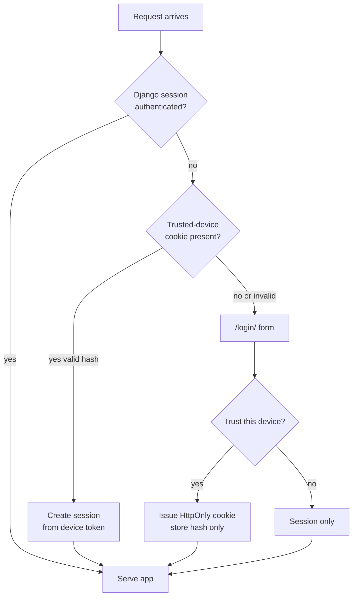

# Privacy and exposure

This app stores personal health data.

## Rules

- Require application authentication even behind Cloudflare Tunnel.
- Do not treat Cloudflare Access / Tunnel alone as app login.
- Do not put passwords or login tokens in URLs.
- Do not commit workbooks, measurement CSVs, or export dumps.
- Avoid logging measurement values unnecessarily.
- Keep secrets only in `/srv/satellite/secrets/body-history.env`.

## Authentication



- Primary: Django session login.
- Convenience: trusted-device cookie (`HttpOnly`, `SameSite=Lax`, `Secure` when HTTPS).
- Server stores only a hash of the device token.
- Default device lifetime: 180 days.
- Devices can be revoked in **Settings**; logout-all revokes active devices.

## Public hostname

Set your public hostname in host secrets (`DJANGO_ALLOWED_HOSTS` /
`DJANGO_CSRF_TRUSTED_ORIGINS`). Do not commit the real hostname.

LAN / direct port (private network), example shape only:

```text
<lan-ip>:3060
```

Prefer HTTPS via the tunnel; keep `DJANGO_SECURE_COOKIES=1` when browsers use HTTPS.

## Git hygiene

Safe to commit:

- application source
- `.env.example` with placeholders only
- docs that describe shapes / ops without real credentials or personal measurements

Never commit:

- real `DJANGO_SECRET_KEY` / DB passwords / bootstrap passwords
- `imports/` contents
- `*.xlsx`, measurement exports, personal note dumps of readings
